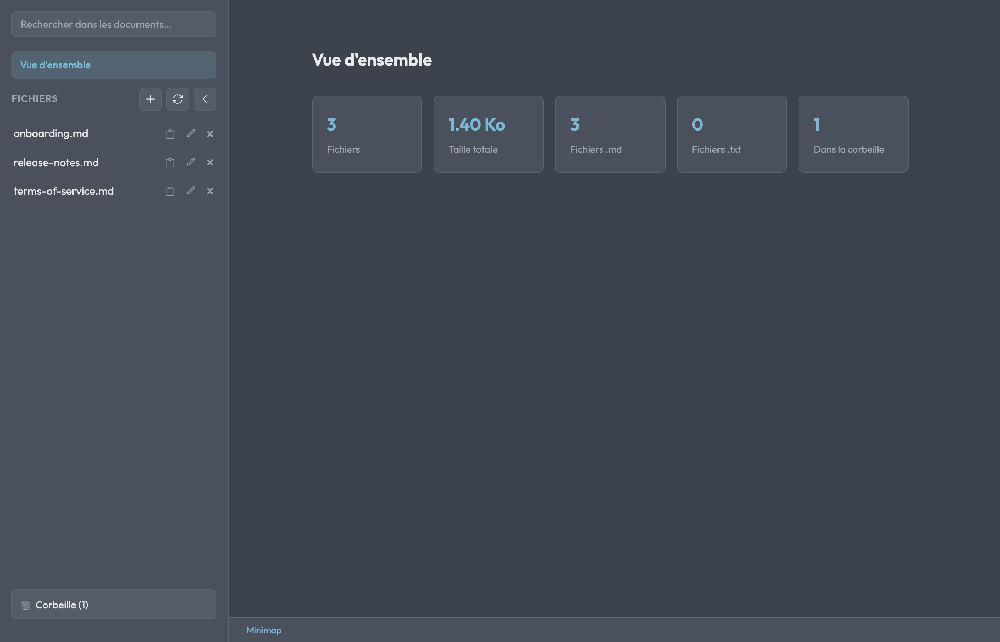
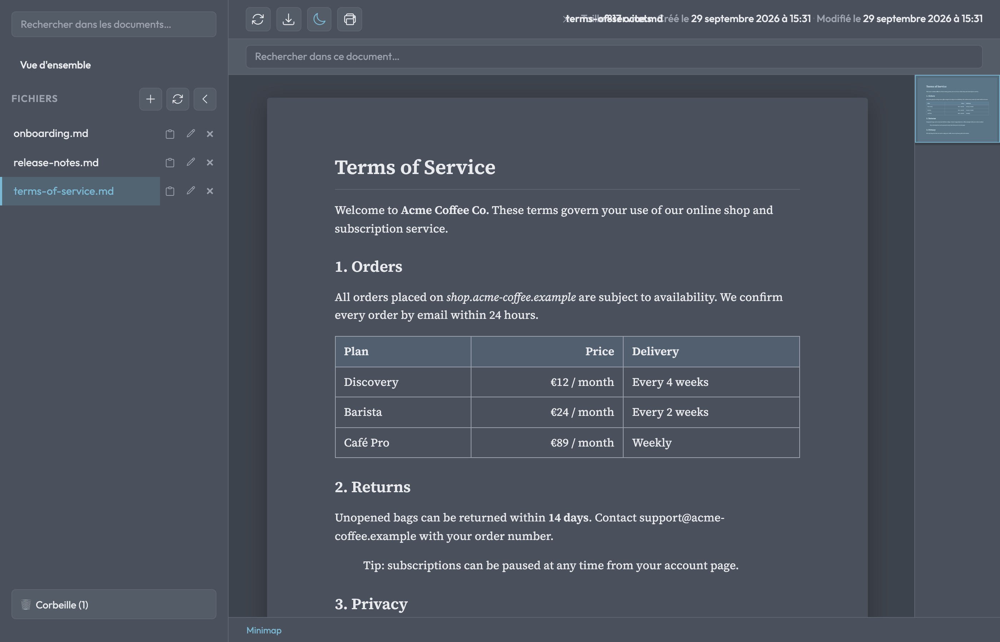

# Markdown Viewer

A small web app to browse, read and print Markdown files as clean, paginated documents. It lists every `.md` / `.txt` file in a folder, renders them as HTML and exports them to PDF on the server side with headless Chromium (Puppeteer). Handy for terms of service, documentation or notes that you want to read comfortably and print.

> The UI is in French.

## Screenshots

*Screenshots use made-up sample documents.*

| Overview | Document |
| --- | --- |
|  |  |

## Features

- **File list** of all `.md` and `.txt` files in the `files/` folder (sub-folders included), with full-text search.
- **Markdown rendering** with `react-markdown` (GFM tables, task lists, code blocks), front matter support and a minimap.
- **PDF export**: the *Print* button generates a PDF on the server (Puppeteer/Chromium). Level-1 headings (`#`) start a new page; `<!-- mdv:page -->` forces a page break; the `pdfFooter` front-matter key sets the footer.
- **Trash**: deleted files go to a trash and can be restored (a `_restored_<datetime>` suffix is added on name conflicts).
- Upload, rename and copy files from the sidebar; light and dark themes.

## Stack

- **Backend**: Node.js 20 + Express
- **Frontend**: React 18 + Vite + react-markdown
- **PDF**: Puppeteer (Chromium)
- **Container**: Docker + Docker Compose

## Getting started

### With Docker (recommended)

1. Put your Markdown files in a `files/` folder at the repository root (it is git-ignored).
2. Start the dev stack (hot reload):

   ```bash
   docker compose up --build
   ```

3. Open <http://localhost:3001>, pick a file and use **Imprimer** to generate the PDF. In the browser print dialog, untick "Headers and footers" to hide the URL and date.

Production build: `docker compose -f docker-compose.prod.yml up --build`.

### Without Docker

```bash
npm install && (cd client && npm install) && (cd server && npm install)
npm run dev
```

The client runs on <http://localhost:3001> and the API on port 3002 (proxied by Vite). `npm run start` builds the client and serves everything from the Node server. PDF export needs Chromium/Chrome on the machine; set `PUPPETEER_EXECUTABLE_PATH` if needed.

## Configuration

| Variable | Description | Default |
|----------|-------------|---------|
| `PORT` | Server port | `3002` (dev) / `3001` (local prod) / `3000` (Docker) |
| `FILES_DIR` | Folder containing the Markdown files | `../files` or `/app/files` (Docker) |
| `STATIC_DIR` | Built client folder (production) | `../client/dist` |
| `PUPPETEER_EXECUTABLE_PATH` | Chromium/Chrome path for PDF export | unset |

## API

- `GET /api/files` — list `.md` and `.txt` files
- `GET /api/files/:path` — raw file content
- `DELETE /api/files/:path` — move to trash
- `GET /api/trash` — list trashed files
- `POST /api/trash/restore` — restore a file (`{ path }`)
- `GET /api/export-pdf?path=...` — generate and download the PDF

## Project structure

```
markdown-viewer/
├── files/                  # your .md files (git-ignored, mounted as a Docker volume)
├── client/                 # React app (Vite)
├── server/                 # Express API + PDF template
├── Dockerfile              # production image
├── Dockerfile.dev          # dev image (hot reload)
├── docker-compose.yml      # dev stack
└── docker-compose.prod.yml # production stack
```
